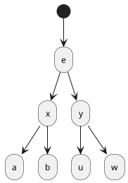

# Деревья

## Терминология

* Дерево -- связный граф без циклов.
* Количество ребер в дереве -- N - 1
* Корень -- вершина, за которую мы 'подвешиваем' дерево
* Лист -- вершина степени 1 (с 1 ребром), но не корень.
* Лес -- граф, где каждая компонента связности -- дерево

## IsAncestor

### Массивы tin/tout

Заведем таймер, который будем увеличивать на 1 при каждом посещении вершины в dfs.

Также заведем 2 массива:
1. $tin_u$ -- записываем значение таймера при заходе в вершину u.
2. $tout_u$ -- записываем значение таймера при выходе их вершины u.

Важно: сначала обновляем таймер, затем записываем в массивы.

### Решаем задачу проверки на предка

Задача: поступают запросы из двух вершин, хотим за O(1) отвечать на запросы `является ли вершина a предком вершины b?`

Решение: Заметим, что `a предок вершины b` $\Leftrightarrow tin_a < tin_b \leqslant tout_b < tout_a$.

## Эйлеров обход

Зачем? -- Задачи на поддеревьях сводим к задачам на отрезках. Потом для LCA via RMQ понадобится.

Варианты эйлерова обхода (при запуске dfs):

1. При проходе по ребру выписываем ребро. Полезно например для xor на пути (будет тематическая задача в контесте).
2. При первом заходе (и возможно выходе) из вершины записываем вершину. Полезно в задаче на кол-во различный в поддереве, но там нужно еще ДО.
3. При каждом заходе в вершину выписываем ее. Полезно в LCA via RMQ.

Также храним индексы этого массива для первого (`start`) и последнего (`end`) 'упоминания' вершины (для 2 и 3 вариантов это индекс первого и последнего посещения вершины, а для 1 варианта это индексы ребра с концом в вершине, идущим наверх в сторону корня). Это аналоги массивов `tin`, `tout`.

### Пример. Сумма в поддереве

Хотим уметь в запросы на сумму в поддереве.

Выпишем 2й тип эйлерова обхода с записыванием веса вершины при заходе в нее. Посчитаем преф суммы. Будем делать запросы от `start` до `end` вершины к преф суммам для получения суммы в ее поддереве.

## Диаметр, центроид

### Диаметр

Диаметр дерева -- путь максимальной длины (по ребрам) в дереве.

#### Как искать диаметр? Алгоритм 1

Давайте зафиксируем самую высокую (близкую к корню) вершину $u$ кандидата на диаметр. Теперь нужно найти два различных пути с максимальной суммой из $u$ вниз: $toLeaf(a) + toLeaf(b) \to max_{a, b \in child(u)}$. Это и будет кандидат на диаметр. Выберем максимум из таких кандидатов по всем вершинам.

Значения $toLeaf$ -- максимальный путь вниз от вершины можно считать динамикой. Важно также учитывать просто путь вниз $toLeaf(u)$, так как решение с  $toLeaf(a) + toLeaf(b) \to max_{a, b \in child(u)}$ может сломаться на бамбуке. O(n)

#### Как искать диаметр? Алгоритм 2

Решение в 2 дфса. Идем от корня $r$ вниз к самой далекой вершине $a$. Затем найдем наиболее удаленную от $a$ вершину $b$. Утверждается что $a\to b$ -- диаметр. O(n).

Доказательство:

Докажем что вершина $a$ (которая самая далекая от корня (темной вершины)) является концом диаметра. Картинка (ребра на самом деле пути разной длины, я просто не рисовал вершины на них):

Пусть существует диаметр $u\to w: dist(u, w) > dist(a, b)$.
Но мы знаем следующее:
* $dist(u, e) > dist(y, u)$
* $dist(a, e) > dist(w, e) > dist(w, y)$ -- по построению
* $dist(u, w) = dist(u, y) + dist(y, w) < dist(a, e) + dist(e, u) = dist(a, u)$.

То есть мы получили противоречие, что $u\to w$ -- диаметр.

Также мы знаем, что $dist(a, b) > dist(a, u) > dist(u, w)$ -- получили, что $a\to b$ -- диаметр.

<!-- Почему? Пусть существует путь $c\to d$ длиннее. Пусть $d$ дальше от изначального корня, чем $c$. Тогда $root\to d \leq root\to a$

* $root\to a \geq root \to d \geq root\to c$
* $a\to b \geq a\to c$
* $a\to b \geq a\to d$
* $d\to c > a\to b$ -->

### Центроид

Центроид дерева -- такая вершина, после удаление которой дерево распадается на деревья размером не более чем $\frac{n}{2}$.

Алгоритм: Будем спускаться каждый раз в поддерево максимального размера. Если вершина -- центроид, то мы нашли ответ и остановимся. Иначе продолжим спуск.

Доказательство (https://neerc.ifmo.ru/wiki/index.php?title=Centroid_decomposition):
Пусть в произвольный момент времени v — не центроид и размер её наддерева меньше $\frac{n}{2}$, значит максимальное поддерево имеет размер больше чем $\frac{n}{2}$ то есть $|subtree(u)|>\frac{n}{2}$, а значит размер "наддерева" вершины $u$ равен $n − |subtree(u)|<\frac{n}{2}$. При этом теперь размер любого поддерева, на которое распадется дерево $t$ при удалении вершины $u$ не превосходит $|subtree(u)|−1$, так как наддерево имеет размер меньше, чем поддерево $u$, а любое поддерево вершины $u$ имеет хотя бы на 1 вершину меньше (сама вершина $u$). По индукции получаем, что в любой момент времени размер наддерева вершины $v$ меньше $frac{n}{2}$, значит мы будем спускаться только вниз по дереву t, и при переходе к вершине u — сыну v размер максимального поддерева уменьшится как минимум на 1. Значит не более чем за n шагов наши действия прекратятся и мы окажемся в центроиде дерева t.

### Центр дерева

Центр графа -- вершина, у которой максимальное расстояние до других вершин минимально среди вершин в графе. Более формально, $e(u) = \max_{v\in V} dist(u, v)$ -- эксцентриситет u. $r(G) = \min_{v\in V} e(v)$ -- радиус графа. Центр графа $u\in V : e(u) = r(G)$.

Как искать центр за O(n) для дерева?

1. Удалим все листья в дереве.
2. В новом дереве образуются новые листья.
3. Если вершин в новом дереве > 2, повторим шаг 1.
4. Если вершин не более 2, это значит, что они являются центрами дерева.

Для удаления достаточно поддерживать очередь из листьев. Удалять элементы из начала очереди, и складывать в конец очереди неудаленных соседей вершины. 

[Доказательство:](https://neerc.ifmo.ru/wiki/index.php?title=%D0%90%D0%BB%D0%B3%D0%BE%D1%80%D0%B8%D1%82%D0%BC%D1%8B_%D0%BD%D0%B0_%D0%B4%D0%B5%D1%80%D0%B5%D0%B2%D1%8C%D1%8F%D1%85)

Очевидно для деревьев с одной и двумя вершинами. Покажем, что у любого другого дерева T те же центральные вершины, что и у дерева T′, полученного из T удалением всех его висячих вершин. Расстояние от данной вершины дерева u до любой другой вершины v достигает наибольшего значения, когда v – висячая вершина. Таким образом, эксцентриситет каждой вершины дерева T′ точно на единицу меньше эксцентриситета этой же вершины в дереве T, следовательно, центры этих деревьев совпадают. Продолжим процесс удаления и получим требуемое.

## Дп по поддеревьям

### База

https://codeforces.com/contest/161/problem/D

Дано дерево из n вершин и положительное число k. Посчитайте количество различных пар вершин дерева, расстояние между которыми равно k. Обратите внимание, что пары (v, u) и (u, v) считаются одной и той же парой. $n\leq 10^4, k \leq 500$.

Для каждой вершины считаем $dp[u][t]$ - количество вертикальных путей длины $t$ в из вершины $u$ вниз. Тогда $dp[u][t] = \sum_{a\in child_u}dp[a][t - 1]$. А кол-во путей длины $k$, для которых $u$ - самая высокая вершина - $dp[u][k] + \sum_{t=1...k}\sum_{a\in child_u}dp[a][t - 1]\cdot(dp[u][k - t] - dp[a][k - t - 1])$. То есть сначала все вертикальные пути длины $k$, затем пути с перегибами в вершине $u$. Итого O(nk).

### Переподвешивания (наддерево)

Иногда бывает полезно кроме величины dp в поддереве считать некоторую величину в наддереве (всем остальном дереве кроме поддерева текущей вершины). Делать это можно так:
1. сначала считаем некую величину только в поддеревьях.
2. при спуске $u\to a$ мы обновим величину в наддереве величиной поддерева $u$ за вычетом величины в поддереве $a$. Так у нас проход по ребру будет за O(обновление величины).

Посмотрим пример.

https://codeforces.com/contest/1092/problem/F

Стоимость вершины $=c_a$. Стоимость дерева для вершины $u: dp[u] = \sum_{a\in V}dist(u, a)\cdot c_a$. Найдите макс стоимость дерева. $n\leq 10^5$.

Будем считать количество вершин в наддереве $u: up[u]$ и для поддерева $down[u]$. Посмотрим как можно пересчитать $dp[a]$ при спуске по ребру $u\to a$.

Сначала посчитаем $dp_{down}[u]= \sum_{a\in subtree(u)}dist(u, a)\cdot c_a = \sum_{a\in child(u)}dp_{down}[a] + down[a]$ (тк каждый dist увеличивается на 1).

Теперь осталось посчитать все пути, которые идут наверх и куда-то далее в другое поддерево. Будем поддерживать $dp_{up}[u]$ - сумма величин всех путей, которые 'идут' сверху. Тогда при переходе вниз по ребру $u\to a: dp_{up}[u] + up[u]  + down[u] - down[a]$

### Переливания

Рассмотрим задачу количества различных в поддереве каждой вершины. Такую задачу удобно было бы решать с помощью $set/unordered\_set$. Но давайте разберем как посчитать такое для каждой вершины в дереве за быстро. Пусть $cnt_u$ - set различных в поддереве вершины $u$ (включая ее саму). Количество различных -- это размер этого сета. Очевидно какое значение $cnt$ будет для листьев.

Теперь как посчитать это для не-листа. Пусть мы считаем для вершины $u$, которая не-лист. Выберем ее ребенка $a\in child_u$с максимальным размером поддерева. set этого ребенка теперь будет сетом вершины $u$. Важно, что его нужно не копировать, а например хранить по указателю. Теперь пройдемся по всем детям вершины $u$ кроме $a:\ \ b\in child_u, b\neq a$, для каждого ребенка $b$ пройдем по его сету и обновим значениями из его сета $cnt_b$ значения в сете $cnt_u$.

Почему это работает быстро и сколько оно вообще работает?

Посмотрим на вершину $t$. Сколько раз мы ее перельем из одного сета в другой? Пусть мы сейчас стоим в вершине $u$, вершина $t$ находится в $cnt_a, a\in child_u$. Тк мы переливаем $cnt_a$, у $u$ был другой ребенок $b: |cnt_b| \geq |cnt_a|$. Это значит, что $|cnt_u|\geq |cnt_a|\cdot 2$. То есть при каждом переливе мы увеличиваем количество вершин хотя бы в 2 раза. Поэтому это работает в сумму за $O(nlogn\cdot update)$, где $update$ -- сложность операции на перелив. Для set это O(logn), для unordered_set это O(1).